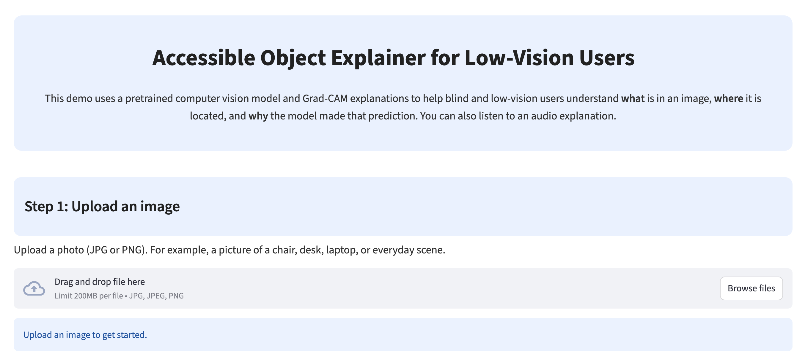
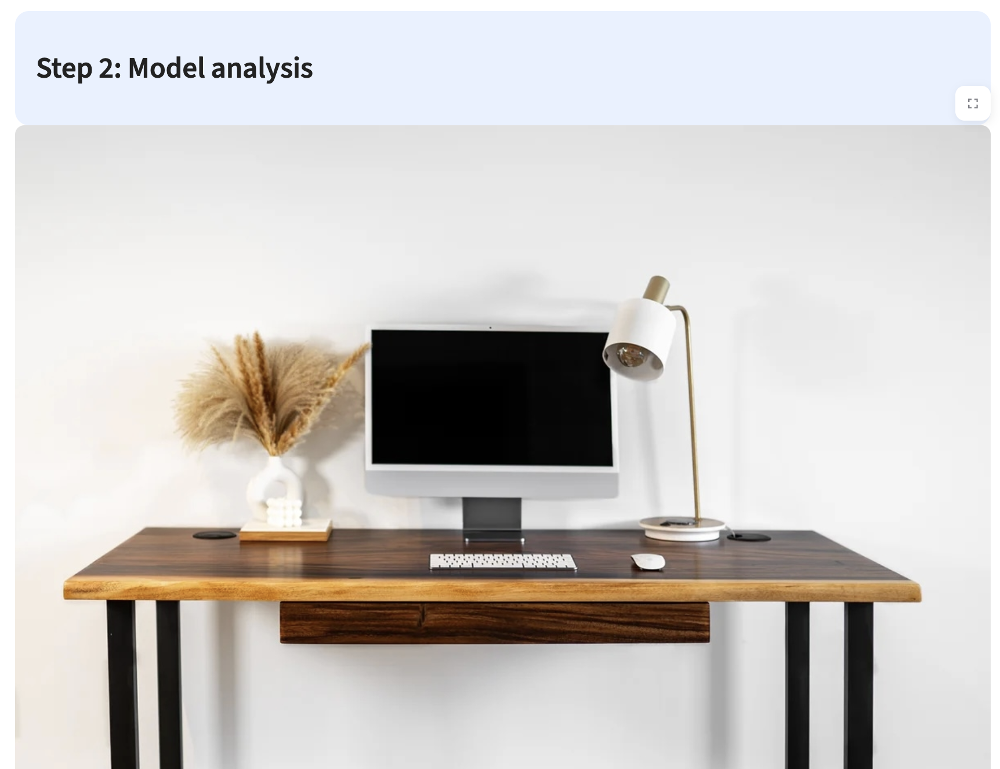
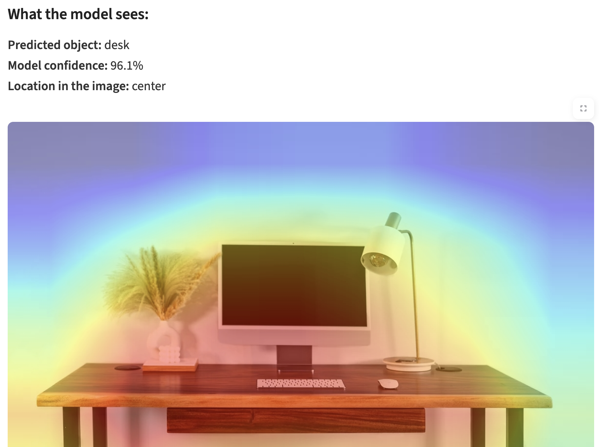
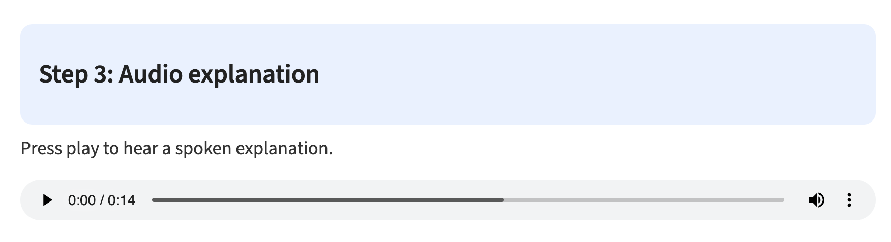

# Accessible Object Explainer for Low-Vision Users  

This project builds an accessible, real-time image explainer designed to help blind and low-vision users understand what is in an image, where key objects are located, and why a computer vision model made a particular prediction. The app uses *ResNet18*, *Grad-CAM*, and *Google Text-to-Speech (gTTS)* to generate both visual and audio explanations.

## Live Demo
 
https://xai-lowvision-explainer.streamlit.app

## Motivation

Blind and low-vision individuals often get limited or incomplete information from existing assistive tools, which may name an object but fail to tell users where it is or provide enough context to feel confident relying on it. This can make everyday interactions with unfamiliar spaces or images feel uncertain and dependent on guesswork. This work aims to support greater independence by giving users clearer, more intuitive feedback, and to help them not only identify what’s in an image but also understand its layout and feel more assured about the information they receive.


## Features
- Image Upload: Users can upload any JPG/PNG image.  
- Object Recognition: A pretrained ResNet18 predicts the top object class.  
- Grad-CAM Heatmaps: Highlights influential regions that drove the prediction.  
- Spatial Description: Converts heatmap activation into a simple phrase  
  (e.g., “top left”, “center right”).  
- Audio Explanation: gTTS generates a spoken summary of what the model sees.  
- Accessible UI: Large fonts, clean layout, color-safe background, and step-by-step workflow.


## App Screenshots

### Homepage



### Model Analysis




### Audio Explanation



## How The App Works

**1️. Upload an Image**  
Users select a JPG/PNG file. The app displays the original image.

**2️. Model Analysis**  
- The image is preprocessed and passed to a pretrained ResNet18 model.
- Grad-CAM generates a heatmap from the final convolution layer.
- The app produces the predicted label, model confidence, and a simple spatial phrase.

**3️. Visual Explanation**  
The Grad-CAM heatmap is blended with the uploaded image to show where the model focused.

**4️. Audio Explanation**  
A spoken explanation is generated using gTTS to support blind and low-vision users.


## Project Structure

- `app.py` — Main Streamlit app
- `utils.py` — Grad-CAM utilities, model loading, heatmap generation
- `requirements.txt` — Dependency list
- `README.md` — Documentation
- `sample_images/` — Optional example images for testing


## Installaton and Running Lacally

**1. Clone the repository:**
```python
git clone https://github.com/ailina-aniwan/xai-lowvision-explainer.git

cd xai-lowvision-explainer
```
**2. Install dependencies:**
```python
pip install -r requirements.txt
```
**3. Run the app:**
```python
streamlit run app.py
```
The app will open at http://localhost:8504

## Deployment

Deployment is through Streamlit Community Cloud:

1. Push the repository to GitHub
2. Go to [share.streamlit.io](https://share.streamlit.io)
3. Select the repository and choose `app.py` as the entry point
4. Add `requirements.txt`
5. Click “Deploy”

The app updates automatically when you push new commits.

## AI Acknowledgment

AI tools (ChatGPT/GPT-5) were used to support portions of the writing, code structuring, and interface refinement.
